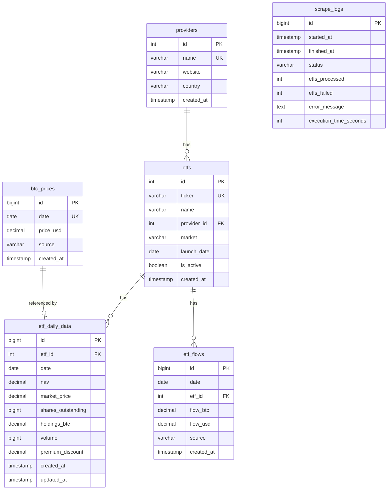

The scraper supports PostgreSQL/Supabase for persistent data storage.

### Entity Relationship Diagram

### Tables Overview

| Table | Description | Records |
|-------|-------------|---------|
| `providers` | ETF issuers (Grayscale, BlackRock, etc.) | 13 |
| `etfs` | Bitcoin ETF products | 14 |
| `etf_daily_data` | Daily NAV, price, holdings per ETF | Growing |
| `etf_flows` | Daily BTC flows from CoinMarketCap | Growing |
| `btc_prices` | Historical BTC prices (USD) | Growing |
| `scrape_logs` | Scraper execution history | Growing |

### Views

- `v_etf_summary` - Daily summary of all ETFs with calculated AUM
- `v_etf_latest` - Most recent data for each ETF

### Duplicate Prevention

All tables use `UPSERT` with `ON CONFLICT` to prevent duplicates:
- `etf_daily_data`: Unique constraint on `(etf_id, date)`
- `etf_flows`: Unique constraint on `(etf_id, date)`
- `btc_prices`: Unique constraint on `date`